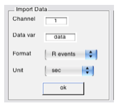
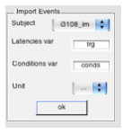
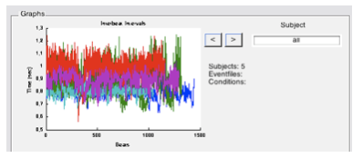
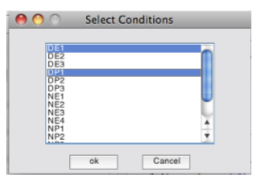
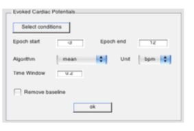
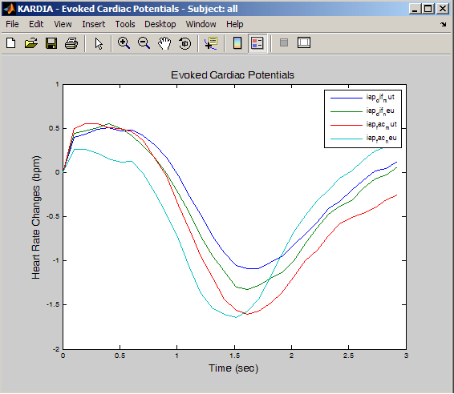
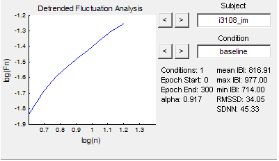

# KARDIA
KARDIA (“heart” in Greek) is a graphic user interface (GUI) designed for the analysis of cardiac interbeat interval (IBI) data. It was originally developed for the Human Psychophysiology research group in the University of Granada in Spain. Its first public release was on 11/2007 under a GNU General Public License.

KARDIA was developed in the Matlab programming language and runs on recent Matlab releases (2007 or later) on all supported operating systems (Mac OS X, Unix and Windows). KARDIA allows interactive importing and visualization of both IBI data and event-related information. Available functions permit the analysis of phasic heart rate changes in response to specific visual or auditory stimuli, using either weighted averages or different interpolation methods (constant, linear, spline) at any user-defined analysis window or sampling rate. KARDIA also provides functions to calculate all commonly used time-domain statistics of heart rate variability and to perform spectral decomposition by using either Fast Fourier Transform or auto-regressive models. Scaling properties of the IBI series can also be assessed by means of Detrended Fluctuation Analysis. Quantitative results can be easily exported in Excel and Matlab format for further statistical analysis.

KARDIA is freely available under the GNU public license for noncommercial use and open source development.

## How to cite
Perakakis P., Joffily M., Taylor M., Guerra P., Vila J. (2010). KARDIA: a Matlab software for the analysis of cardiac interbeat intervals. Computer Methods and Programs in Biomedicine 98, 83–89.

# Installation
After you download and unzip the KARDIA package, include the main folder and its subfolders to Matlab’s path. Make sure to previously remove any older versions of the program.

# Preparing files for analysis
Before you are ready to use the program to perform any type of analysis, you need to prepare two types of Matlab (.mat) data files. A first one containing the IBIs, or the R-wave events (in seconds or in milliseconds) and a second .mat file containing the event information. In this tutorial we will use the sample data included in the KARDIA distribution to demonstrate the usage of the program. To see the structure of the IBI and event files you can load the variables of one subject to the workspace by typing:

```load i3108_im.mat; load ti3108```

You will see that three new variables are added to your workspace: ```conds```, ```data``` and ```trg```. The ```conds``` variable contains the codes of the different events, while the ```trg``` variable the latencies of these events. Every event file must contain these two variables. The conditions variable of each subject must contain the same codes, although the number of times a specific code is repeated, or the order of codes in the experiment may vary. The data variable contains either the interbeat intervals, or the R-wave events (the accumulated IBI series). In our example data contains R-wave events expressed in seconds.

You can double click the variables in the workspace to see their structure in Matlab’s editor window. There are many different ways to create these variables and save them in mat format. Some data acquisition systems directly export in Matlab format, while it is also possible to load a spreadsheet into Matlab and save the IBIs variable in one file and the conditions and latencies variables in another, using a command like the following:

```save ('i3108_im.mat', 'data'); save ('ti3108.mat', 'trg', 'conds');```

After preparing your IBI and event files, start the GUI by typing:

```kardia```

# Import data and events
To import the IBI information, first select the channel that contains the data (this is useful if your variable is a matrix containing more columns of data) and then the name of the data variable. Finally choose if the data is IBIs or R-wave events and if the time unit is seconds or milliseconds. For the sample data Channel is ```1```, Data var is ```data```.



When you click ok a window opens that lets you select the files containing the IBI data that you wish to analyze. After opening the files KARDIA plots the IBI information for each subject in the first graph of the graph panel. You can scroll through subjects using the arrows or type the name of a subject file in the edit box to jump directly to that subject. Clicking inside the graph pops an editable Matlab figure, giving you more visualization options and the possibility to export the graph in various formats.

To import the event information first select from the drop subject menu the subject that you wish to import information for. Then type the name of the variable that contains the event latencies and the name of the variable that contains the codes (```trg``` and ```conds``` respectively in our example). Choose the time unit in which the event latencies are expressed and click ok.

In the window that opens you can only select one event file at a time. To select an event file for a different subject, select this subject from the drop list and repeat the procedure described above.



When you import an event file the number of ```Eventfiles``` in the graph panel is automatically updated. In case you want to use the same event file for all subjects, assuming that the same events occur at the same latencies in every recording, import this event file for the first subject in the drop list and continue with the analysis without importing any other event files.



# Evoked Cardiac Potentials (ECP)
You can use the ECP module to analyze phasic cardiac responses time-locked to specific events in your experiment. First select the conditions (codes of events) that you wish to analyze by clicking the ```Select Conditions``` button. Our sample data was obtained in a guided imagination paradigm of neutral and unpleasant scenes. The unpleasant scenes were either randomly selected or personalized for each subject according to a previous psychological assessment. To compare the first trial of a negative random scene with the first trial of a negative personalized scene choose conditions ```DE1``` and ```DP1```.



After selecting conditions you need to define the epoch limits. Epoch start must be a negative number designating the duration of the baseline before stimulus onset. For our example choose Epoch start ```-3``` and Epoch end ```12```. This means that the program will calculate a three second baseline before stimulus onset and heart rate values for twelve subsequent seconds.

After defining epoch limits choose the algorithm you wish to apply for the estimation of heart rate changes:

1.```mean``` - calculates weighted averages within an analysis window according to the methodology described in [Reyes del Paso & Vila, 1998](Documentation/Articles/reyesdelpaso1998.pdf).

2.```CDR``` - applies the algorithm for the estimation of the cardiac defense response according to the paradigm described in [Vila et al., 2007](Documentation/Articles/Cardiac-defense-From-attention-to-action_2007_International-Journal-of-Psychophysiology.pdf).

3 ```constant```, ```linear```, ```spline``` - perform different interpolation methods. ```constant``` seems to be the most frequently used technique to calculate the averaged instantaneous heart period or rate in psychophysiology studies. It considers that HR is constant between adjacent HR intervals. However, it seems to be the least effective estimate of the true spectrum. Thus, for spectral estimation, the ```spline``` method should be prefered.

The ```Unit``` option determines the output of the analysis; ```bpm``` for heart rate in beats per minute and ```sec``` for heart
period in seconds. ```Time window``` lets you define the analysis window when using the mean algorithm, or the sample rate for the interpolation methods (CDR overrides time window as well as as epoch limits and performs the analysis according to the standards described in . Finally, check the ```Remove baseline``` box if you want to subtract the baseline value from the estimated heart rate values (the baseline is always calculated with the mean algorithm).



When you click ```ok``` KARDIA plots the results in the second graph. Again you can scroll through subjects or see the grand average of all subjects for all conditions. Clicking inside the graph pops a separate Matlab figure.



# Heart Rate Variability
To perform a variability analysis first select conditions by clicking the ```Select conditions``` button. Unlike ECP codes, each HRV code can appear only once in the event file. If you want to perform HRV analysis to more than one segments you should give them different code names (for example HRV1, HRV2, HRV3 etc).

In our example we can choose the ```baseline``` code which marks the beginning of a 5-minute rest period. We select Epoch start ```0``` and Epoch end ```300``` to create the 5-minute epoch. When you click ok KARDIA plots the selected segments in the third graph. Once again, you can scroll through subjects and conditions using the arrows and pop a Matlab figure by clicking inside the graph.

The next panel in the HRV module lets you select various parameters for spectral analysis. In the first step, KARDIA resamples the IBI data using spline interpolation at a sample rate defined by the user (2Hz or 4Hz). Subsequently, constant or linear detrending is performed using Matlab’s detrend function. The IBI series is then multiplied by a hanning, hamming, blackmann or bartlett window, using Matlab’s built-in functions. The user can then choose between performing a Discrete Fourier transform or applying an auto-regressive model to estimate the Power Spectral Density (using Matlab’s fft and arburg functions respectively). The resolution of the spectrogram depends on the number of points selected by the user. The auto option automatically assigns:

'''N=2^nextpow2(length(hp))'''

where N is the number of points and hp the IBI series.

The frequency ranges of the HF, LF and VLF spectral bands are defined in the specpower function. Default values are HF:0.15-0.4Hz, LF:0.04-0.15Hz and VLF:0-0.04Hz. Specpower is a nested function in ```kardia.m``` and can be easily modified by the user. The power in these frequency bands is a measure extensively used in psychophysiological experiments and is expressed in ms^2. KARDIA displays the spectrogram and the HRV statistics for each subject and each condition in the third graph of the graph panel (all HRV statistics are expressed in milliseconds).

The last HRV module is used to perform the detrended fluctuation analysis (DFA), an algorithm proposed by Peng et.al for the quantification of scaling exponents in non-stationary time series. Here you can select the range of boxes and if you want to use adjacent or overlapping (sliding) windows.



# Save data
KARDIA keeps all current information about subjects, events and performed analyses in a variable called ```DATA```. At any moment you can click the disc icon on the GUI’s toolbar, choose a filename and save the DATA variable in the current directory. When you load this mat file the DATA variable appears on the workspace. You can now call the GUI using this variable as its input by typing:

```kardia(DATA)````

This command recovers the GUI at its state when the variable DATA was saved. Since the import of event information has to be performed individually for each subject, it is a good idea to save your work after completing this step, so that you don’t have to repeat it again in the future.

# Export to Excel
By clicking the Excel icon on the GUI’s toolbar you save all current information in an excel file for posterior statistical analysis. Depending on the processing speed of your hardware, Matlab needs some time to finish exporting the data to the excel spreadsheets. Make sure the process is finished before trying to access the excel file.
